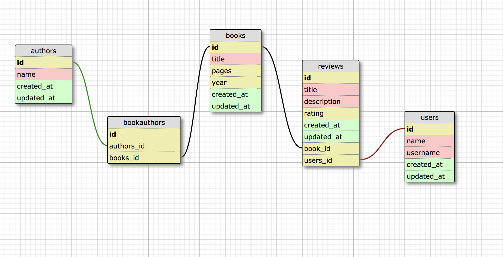

[](https://waffle.io/wfischer42/book_club)

## Database Schema


# Book Club

Backend Module 2 paired Rails project, weeks 2 and 3


## Background and Description

This purpose of this application is for users to browse and review books. The primary goal of this challenge is testing your ability to set up many-to-many relationships and accessing attributes through multiple models.


## Learning Goals for this Project

- creation of a basic Rails web application
- implementing basic MVC structure to your project
- save and retrieve data from a database
- display content on a web page with some very basic styling
- learning how to test your code effectively at a Controller and a Model level


## Requirements

- must use Rails 5.1.x
- must use PostgreSQL
- all controller and model code must be tested via feature tests and model tests, respectively
- must use some amount of HTML and CSS layout

## Setup - Terminal Commands

-git clone https://github.com/bdiveley/book_club.git
-rails db:{drop,create,migrate,seed}
-rails s
-visit localhost:3000 in browser 

### User Stories

```
As a Visitor,
When I visit a book index page,
I see all book titles in the database.
Each book entry on the page shows the author(s) and number of
pages in the book, and the year it was published.
```

```
As a Visitor,
When I visit the book index page,
Next to each book title, I see its average book rating
And I also see the total number of reviews for the book.
```

```
As a Visitor,
When I visit the book index page,
I should see one link each to sort the books by the following criteria:
- sorted by average rating in ascending order
- sorted by average rating in descending order
- sorted by number of pages in ascending order
- sorted by number of pages in descending order
- sorted by number of reviews in ascending order
- sorted by number of reviews in descending order
```

```
As a Visitor,
When I visit the book index page,
I see an area showing statistics about all books:
- three of the highest-rated books
- three of the worst-rated books
- three users who have written the most reviews
```

### Book Show Page

```
As a Visitor,
When I visit a book's show page,
I see the book title, the author(s) and the number of pages
in the book.
I also see a list of reviews for that book.

Each review will have a title and user, a numeric rating
from 1 to 5, and text for the review itself, and all content
must be present for each review.
```

```
As a Visitor,
When I visit a book's show page,
I see an area on the page for statistics about reviews
containing information such as:
- the top three reviews for this book (title, rating and user only)
- the bottom three reviews for this book  (title, rating and user only)
- the overall average rating of all reviews for this book
```

### Adding New Content

```
As a Visitor,
When I visit the book index page,
I see a link that allows me to add a new book.
When I click that link, I am taken to a new book path.
I can add a new book through a form, including the book's
title, author(s), and number of pages in the book.
When I submit the form, I am taken to that book's show page.

Book titles should be converted to Title Case before saving.
Book titles should be unique within the system.
For authors, a comma-separated list of names should be entered,
and each author will be added to the database.
```

```
As a Visitor,
When I visit a book's show page
I see a link to add a new review for this book.
When I click on this link, I am taken to a new review path.
On this new page, I see a form where I can enter:
- a review title
- my name
- a numeric rating that can only be a number from 1 to 5
- some text for the review itself
When the form is submitted, I should return to that book's
show page and I should see my review text.

User names should be converted to Title Case before saving.
```


### Author Show Page

```
As a Visitor,
When I visit an author's show page
I see all book titles by that author
And each book should show its number of pages and any other authors
excluding the author that this show page is about.
```

```
As a Visitor,
When I visit an author's show page,
Next to each book written by that author, I should see one of
the highest rated reviews for the book (title, score, and user name).
```


### User Show Page

```
As a Visitor,
When I click on a user's name for any book review
I am taken to a show page for that user.
I should see all reviews (title, rating and text) that this
user has written.
I should also see links to sort reviews in the following ways:
- sort reviews newest first (descending chronological order)
- sort reviews oldest first (ascending chronological order)
```

### Deleting Content

```
As a Visitor,
When I visit a user's show page,
I see a link next to each review to delete the review.
When I delete a review I am returned to the user's show page
Then I should no longer see that review.
```

```
As a Visitor,
When I visit a book's show page,
I see a link on the page to delete the book.
This link should return me to the book index page where I
no longer see this book listed.

(you may need to delete other content before you can delete the book)
```

```
As a Visitor,
When I visit an author's show page,
I see a link on the page to delete the author.
This link should return me to the book index page where I
no longer see this author listed.
If this author was the only author for any book, that book is also deleted.

(you may need to delete other content before you can delete the author or book)
```


### Linking All The Things

```
As a Visitor,
With the exception of a book's show page,
Anywhere I see a book title on the site,
I can click on the book title to go to that book's show page.
```

```
As a Visitor,
With the exception of an author's show page,
Anywhere I see an author's name on the site,
I can click on the name to go to that author's show page.
```

```
As a Visitor,
With the exception of a user's show page,
Anywhere I see a user's name on the site for a book review,
I can click on the name to go to that user's show page.
```
